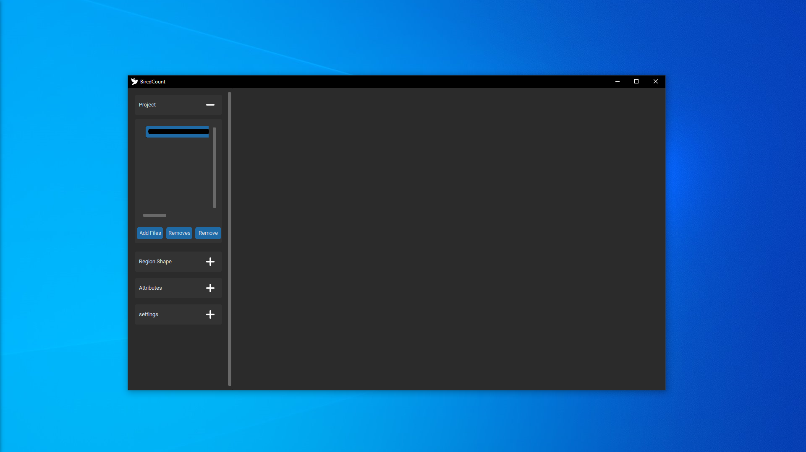
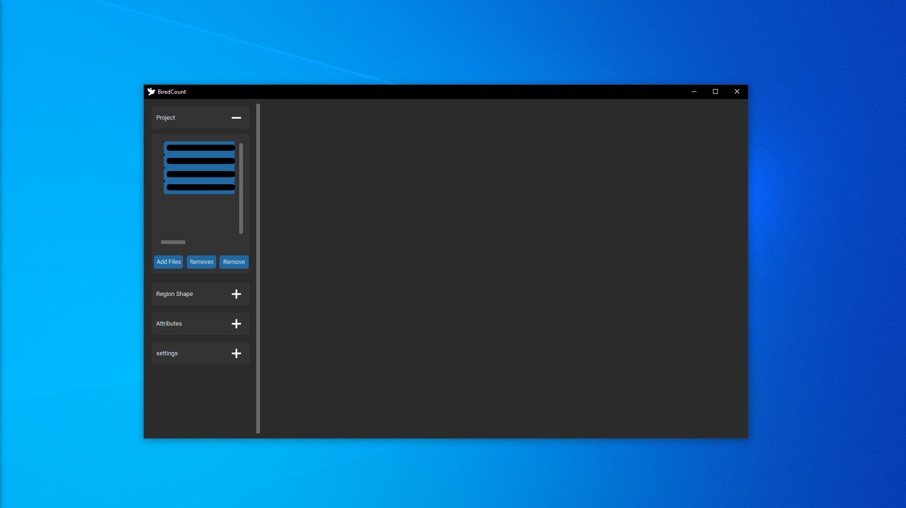

# BirdCount
HSV image analysis application for counting identical objects.

## Description
BirdCount is a python application for counting objects by performing image analysis using the HSV color domain. It lets you perform transformations by playing with hue, saturation, value, threshold and object size values. 

The values, number of objects and result images obtained can be saved and loaded into the application.


| _`app.py` on Windows 10 with dark mode_

## Installation
Install dependencies with pip:
```
pip install -r requirements.txt
```

## Documentation
Click on the plus or minus buttons to expand or hide tab options.

### Project tab

| _`app.py` project tab expand_

Features:
  - Add one or more images.
    
    | _`app.py` Add one image_
    
    | _`app.py` Add multiple image_
  - Delete all images.
  - Delete selected image.
