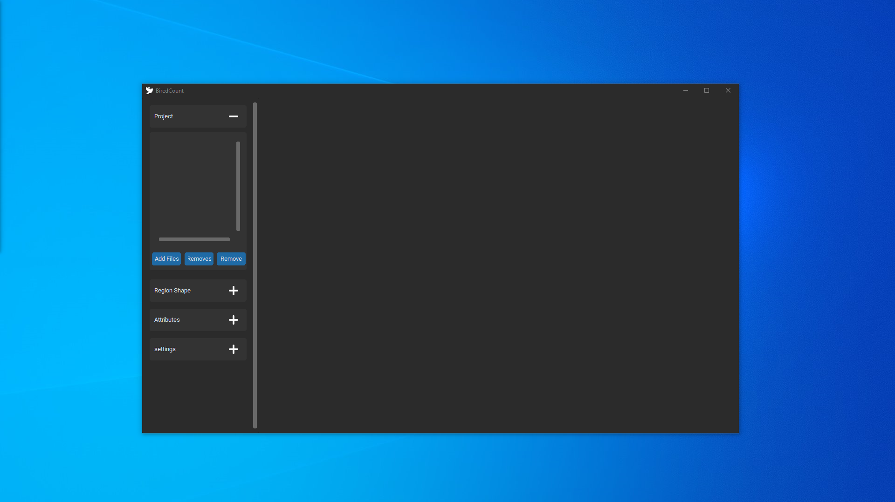

# BirdCount
HSV image analysis application for counting identical objects.

## Description
BirdCount is a python application for counting objects by performing image analysis using the HSV color domain. It lets you perform transformations by playing with hue, saturation, value, threshold and object size values. 

The values, number of objects and result images obtained can be saved and loaded into the application.


| _`app.py` on Windows 10 with dark mode_

## Installation
Install dependencies with pip:
```
pip install -r requirements.txt
```

## Documentation
Click on the plus or minus buttons to expand or hide tab options.

### Project tab

| _`app.py` project tab expand_

Features:
  - Add one or more images.
  - Delete all images.
  - Delete selected image.

### Région shape

| _`app.py` Region shape tab expand_

Features:
  - Selects and zooms in on a square in the image.
  - Cuts the image, keeping only the inside of a polygon.

The square area is selected by holding down the left mouse button. When released, the selected area is displayed.

The polygonal area is selected by adding points with the left mouse button and then validating the polygon with a right mouse button.
The resulting image is used as a reference for further processing.

### Attributes shape

| _`app.py` Attributes tab expand_

Features:
  - Modification of the various values used for image processing and element counting..
  - Save values and number of elements in a config.ini file.
  - Save result images.


